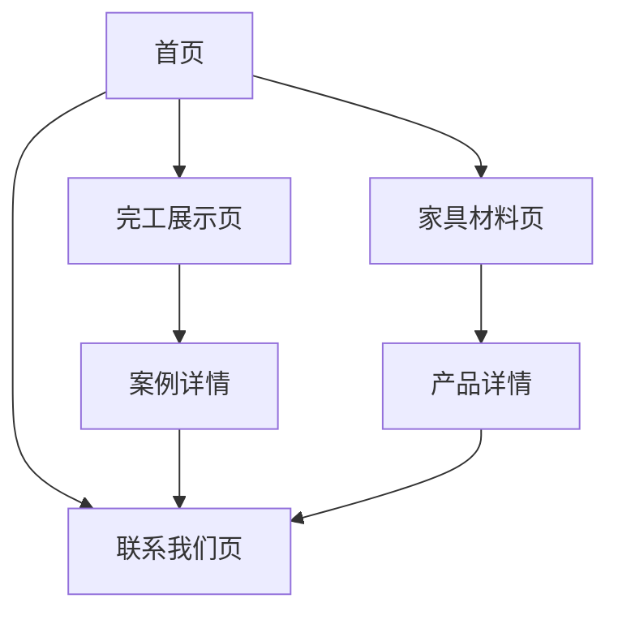

## 1. 产品概览
装修材料店官网是一个展示品牌形象、产品信息和完工案例的企业网站，帮助用户了解公司服务和产品。
- 主要目的是展示装修材料产品和完工案例，吸引潜在客户，提供联系方式。
- 目标用户是需要装修材料的个人和企业客户，以及寻找装修灵感的消费者。

## 2. 核心功能

### 2.1 用户角色
| 角色 | 注册方式 | 核心权限 |
|------|---------------------|------------------|
| 普通用户 | 无需注册 | 浏览网站内容，查看产品和案例 |
| 管理员 | 后台登录 | 管理产品、案例和订单 |

### 2.2 功能模块
1. **首页**：顶部导航、Banner轮播图、推荐案例、热销材料
2. **完工展示页**：案例列表、案例详情、图片轮播
3. **家具材料页**：分类导航、产品卡片、产品详情
4. **联系我们页**：公司信息、联系方式、地图嵌入
5. **后台管理**（可选）：产品管理、案例管理、订单管理

### 2.3 页面详情
| 页面名称 | 模块名称 | 功能描述 |
|-----------|-------------|---------------------|
| 首页 | 顶部导航 | 包含品牌LOGO、首页、完工展示、家具材料、联系我们链接 |
| 首页 | Banner轮播图 | 展示装修效果图或促销活动，自动轮播 |
| 首页 | 推荐案例 | 展示精选完工案例，点击进入详情 |
| 首页 | 热销材料 | 展示热门家具材料产品，点击进入详情 |
| 完工展示页 | 案例列表 | 分页或瀑布流展示案例，支持筛选 |
| 完工展示页 | 案例详情 | 展示案例标题、描述、图片轮播 |
| 家具材料页 | 分类导航 | 按类别（家具、地板、墙纸等）筛选产品 |
| 家具材料页 | 产品卡片 | 展示产品图片、名称、价格 |
| 家具材料页 | 产品详情 | 展示产品详细信息、图片、价格 |
| 联系我们页 | 公司信息 | 展示公司简介、地址、电话、邮箱 |
| 联系我们页 | 地图嵌入 | 显示公司位置地图 |
| 后台管理 | 产品管理 | 添加、编辑、删除产品 |
| 后台管理 | 案例管理 | 添加、编辑、删除案例 |
| 后台管理 | 订单管理 | 查看和处理订单 |

## 3. 核心流程
用户访问网站 → 浏览首页内容 → 查看完工案例或家具材料 → 了解产品详情 → 联系公司咨询

## 4. 用户界面设计
### 4.1 设计风格
- 主色调：温暖的木质色调，搭配中性灰色
- 辅助色：浅米色、淡蓝色
- 按钮风格：圆角矩形，带有轻微阴影
- 字体：无衬线字体，主标题使用较大字号
- 布局风格：卡片式布局，清晰的视觉层次
- 图标风格：简约线条图标，与整体风格一致

### 4.2 页面设计概览
| 页面名称 | 模块名称 | UI元素 |
|-----------|-------------|-------------|
| 首页 | Banner轮播图 | 大图展示，渐变叠加文字，自动轮播，切换动画 |
| 首页 | 推荐案例 | 卡片式布局，图片+标题，悬停效果 |
| 首页 | 热销材料 | 网格布局，产品卡片，价格标签 |
| 完工展示页 | 案例列表 | 瀑布流布局，图片卡片，标题和简短描述 |
| 完工展示页 | 案例详情 | 大图轮播，详细文字描述，返回按钮 |
| 家具材料页 | 分类导航 | 水平标签栏，选中状态高亮 |
| 家具材料页 | 产品卡片 | 白色背景，产品图片，名称，价格，加入购物车按钮 |
| 联系我们页 | 公司信息 | 卡片式布局，图标+文字，清晰易读 |
| 联系我们页 | 地图嵌入 | 响应式地图，标记公司位置 |

### 4.3 响应式设计
- 采用桌面优先设计，适配移动端
- 移动端导航转为汉堡菜单
- 卡片布局在移动端调整为单列
- 图片大小自适应屏幕尺寸

### 4.4 3D场景指导
- 无3D场景需求