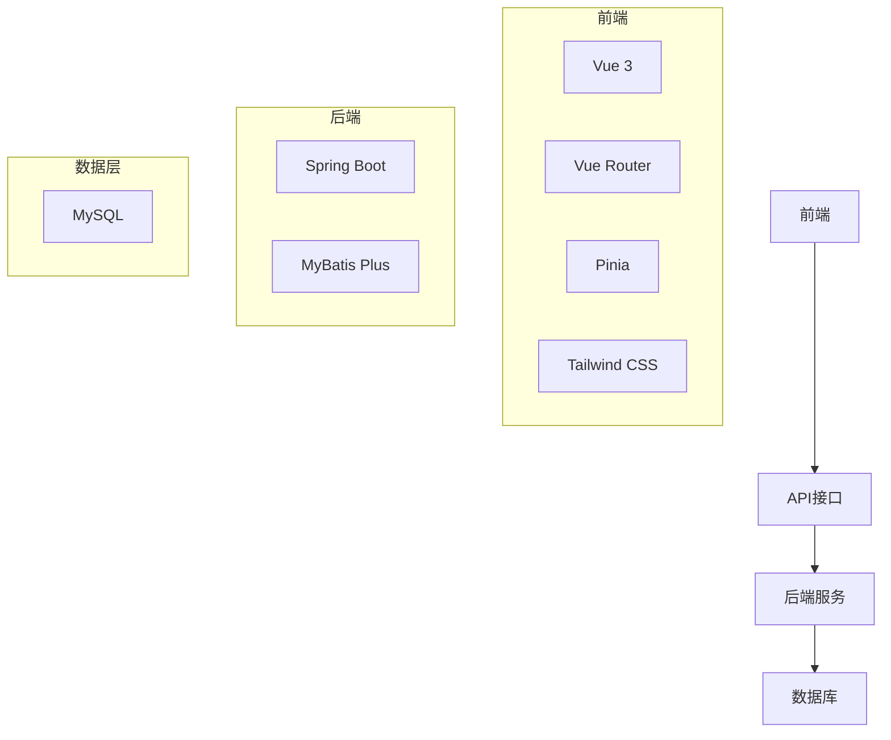
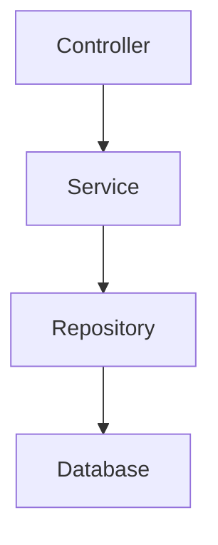
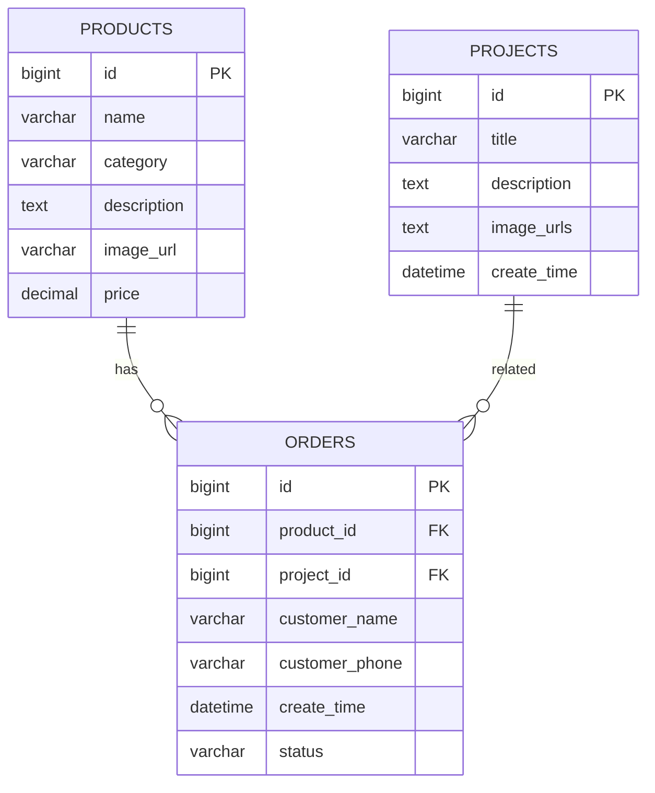

## 1. 架构设计


## 2. 技术描述
- 前端：Vue 3 + Vite + Vue Router + Pinia + Tailwind CSS
- 初始化工具：Vite
- 后端：Spring Boot + MyBatis Plus
- 数据库：MySQL

## 3. 路由定义
| 路由 | 用途 |
|-------|---------|
| / | 首页 |
| /projects | 完工展示页 |
| /projects/:id | 案例详情页 |
| /products | 家具材料页 |
| /products/:id | 产品详情页 |
| /contact | 联系我们页 |
| /admin | 后台管理页 |

## 4. API定义

### 4.1 产品相关API
| 接口 | 方法 | 描述 | 请求参数 | 响应结构 |
|-------|---------|---------|---------|---------|
| /api/products | GET | 获取产品列表 | category(可选) | `{"code": 200, "data": [{"id": 1, "name": "产品名称", "category": "家具", "description": "描述", "image_url": "图片路径", "price": 100.00}], "message": "success"}` |
| /api/products/{id} | GET | 获取单个产品详情 | id(路径参数) | `{"code": 200, "data": {"id": 1, "name": "产品名称", "category": "家具", "description": "描述", "image_url": "图片路径", "price": 100.00}, "message": "success"}` |
| /api/products | POST | 添加产品 | name, category, description, image_url, price | `{"code": 200, "data": {"id": 1}, "message": "success"}` |
| /api/products/{id} | PUT | 更新产品 | id(路径参数), name, category, description, image_url, price | `{"code": 200, "message": "success"}` |
| /api/products/{id} | DELETE | 删除产品 | id(路径参数) | `{"code": 200, "message": "success"}` |

### 4.2 案例相关API
| 接口 | 方法 | 描述 | 请求参数 | 响应结构 |
|-------|---------|---------|---------|---------|
| /api/projects | GET | 获取案例列表 | 无 | `{"code": 200, "data": [{"id": 1, "title": "案例标题", "description": "描述", "image_urls": ["图片1", "图片2"], "create_time": "2023-01-01 12:00:00"}], "message": "success"}` |
| /api/projects/{id} | GET | 获取单个案例详情 | id(路径参数) | `{"code": 200, "data": {"id": 1, "title": "案例标题", "description": "描述", "image_urls": ["图片1", "图片2"], "create_time": "2023-01-01 12:00:00"}, "message": "success"}` |
| /api/projects | POST | 添加案例 | title, description, image_urls | `{"code": 200, "data": {"id": 1}, "message": "success"}` |
| /api/projects/{id} | PUT | 更新案例 | id(路径参数), title, description, image_urls | `{"code": 200, "message": "success"}` |
| /api/projects/{id} | DELETE | 删除案例 | id(路径参数) | `{"code": 200, "message": "success"}` |

## 5. 服务端架构图


## 6. 数据模型

### 6.1 数据模型定义


### 6.2 数据定义语言

#### products表
```sql
CREATE TABLE `products` (
  `id` bigint(20) NOT NULL AUTO_INCREMENT,
  `name` varchar(255) NOT NULL,
  `category` varchar(100) NOT NULL,
  `description` text,
  `image_url` varchar(255) NOT NULL,
  `price` decimal(10,2) NOT NULL,
  PRIMARY KEY (`id`),
  KEY `idx_category` (`category`)
) ENGINE=InnoDB DEFAULT CHARSET=utf8mb4;
```

#### projects表
```sql
CREATE TABLE `projects` (
  `id` bigint(20) NOT NULL AUTO_INCREMENT,
  `title` varchar(255) NOT NULL,
  `description` text,
  `image_urls` text NOT NULL COMMENT 'JSON格式的图片路径数组',
  `create_time` datetime NOT NULL DEFAULT CURRENT_TIMESTAMP,
  PRIMARY KEY (`id`)
) ENGINE=InnoDB DEFAULT CHARSET=utf8mb4;
```

#### orders表
```sql
CREATE TABLE `orders` (
  `id` bigint(20) NOT NULL AUTO_INCREMENT,
  `product_id` bigint(20) DEFAULT NULL,
  `project_id` bigint(20) DEFAULT NULL,
  `customer_name` varchar(100) NOT NULL,
  `customer_phone` varchar(20) NOT NULL,
  `create_time` datetime NOT NULL DEFAULT CURRENT_TIMESTAMP,
  `status` varchar(50) NOT NULL DEFAULT 'pending',
  PRIMARY KEY (`id`),
  KEY `idx_product_id` (`product_id`),
  KEY `idx_project_id` (`project_id`)
) ENGINE=InnoDB DEFAULT CHARSET=utf8mb4;
```

### 6.3 初始数据

#### 产品初始数据
```sql
INSERT INTO `products` (`name`, `category`, `description`, `image_url`, `price`) VALUES
('现代简约沙发', '家具', '舒适透气的现代简约风格沙发，适合各种装修风格', 'https://trae-api-cn.mchost.guru/api/ide/v1/text_to_image?prompt=modern%20simple%20sofa%20in%20living%20room%2C%20clean%20design%2C%20comfortable%2C%20high%20quality%20photography&image_size=square', 2999.00),
('实木地板', '材料', '天然实木地板，环保健康，脚感舒适', 'https://trae-api-cn.mchost.guru/api/ide/v1/text_to_image?prompt=solid%20wood%20floor%2C%20natural%20grain%2C%20high%20quality%2C%20white%20background%2C%20product%20photography&image_size=square', 299.00),
('墙纸', '材料', '环保墙纸，多种花色可选，易清洁', 'https://trae-api-cn.mchost.guru/api/ide/v1/text_to_image?prompt=wallpaper%20samples%2C%20various%20patterns%2C%20white%20background%2C%20product%20photography&image_size=square', 99.00),
('餐桌', '家具', '现代风格餐桌，坚固耐用，适合家庭使用', 'https://trae-api-cn.mchost.guru/api/ide/v1/text_to_image?prompt=modern%20dining%20table%2C%20clean%20design%2C%20white%20background%2C%20product%20photography&image_size=square', 1599.00);
```

#### 案例初始数据
```sql
INSERT INTO `projects` (`title`, `description`, `image_urls`) VALUES
('现代简约客厅', '采用现代简约风格装修的客厅，明亮通透，家具搭配合理，营造温馨舒适的居住环境。', '["https://trae-api-cn.mchost.guru/api/ide/v1/text_to_image?prompt=modern%20simple%20living%20room%2C%20bright%2C%20spacious%2C%20natural%20light%2C%20high%20quality%20photography&image_size=landscape_16_9", "https://trae-api-cn.mchost.guru/api/ide/v1/text_to_image?prompt=modern%20living%20room%20detail%2C%20furniture%20arrangement%2C%20decorative%20elements%2C%20high%20quality%20photography&image_size=landscape_16_9"]'),
('北欧风格卧室', '北欧风格卧室，简洁大方，色彩柔和，给人宁静放松的感觉。', '["https://trae-api-cn.mchost.guru/api/ide/v1/text_to_image?prompt=nordic%20style%20bedroom%2C%20clean%2C%20soft%20colors%2C%20comfortable%2C%20high%20quality%20photography&image_size=landscape_16_9", "https://trae-api-cn.mchost.guru/api/ide/v1/text_to_image?prompt=nordic%20bedroom%20detail%2C%20bedding%2C%20decorations%2C%20high%20quality%20photography&image_size=landscape_16_9"]');
```